  
  
  

---

## ⚡ About Me

> 💻 **Android • Full Stack • Backend Developer**

> 🚀 **Currently Building:** Nexora

> 🌱 **Learning:** System Design • Cloud • AI

> 🤝 **Open Source Contributor**

> 📫 **aavdhesh.dadhich@gmail.com**

---

## 🛠️ Tech Stack

---

## 🌍 Open Source Journey

---

## 🗺️ Developer Journey

---

## 🚀 Featured Projects

### 🎓 [Nexora](https://github.com/Itzzavdheshh/NEXORA) — Mentorship Booking Platform
Mentorship platform with real-time booking.

`React` `Vite` `Tailwind` `Express` `Supabase` `PostgreSQL`

---

### 🔊 [VoiceForge](https://github.com/itzzavdhesh/VoiceForge) — Open Source TTS Platform
Open-source AI text-to-speech platform.

`React` `Node.js` `Chatterbox TTS`

---

### 🖥️ [TabTwin](https://github.com/itzzavdhesh/TabTwin) — Real-Time Browser Collaboration
Real-time browser collaboration platform.

`React` `Vite` `Tailwind` `Node.js` `Chrome MV3`

---

## 📊 GitHub Analytics

  

<picture>
<source media="(prefers-color-scheme: dark)" srcset="https://raw.githubusercontent.com/Itzzavdheshh/Itzzavdheshh/output/github-contribution-grid-snake-dark.svg" />
<source media="(prefers-color-scheme: light)" srcset="https://raw.githubusercontent.com/Itzzavdheshh/Itzzavdheshh/output/github-contribution-grid-snake.svg" />

</picture>
<!--END_SECTION:STATS-->

---

### 👋 Thanks for visiting!

⭐ Thanks for stopping by! If you like my work, consider starring a repository or connecting with me on LinkedIn.

